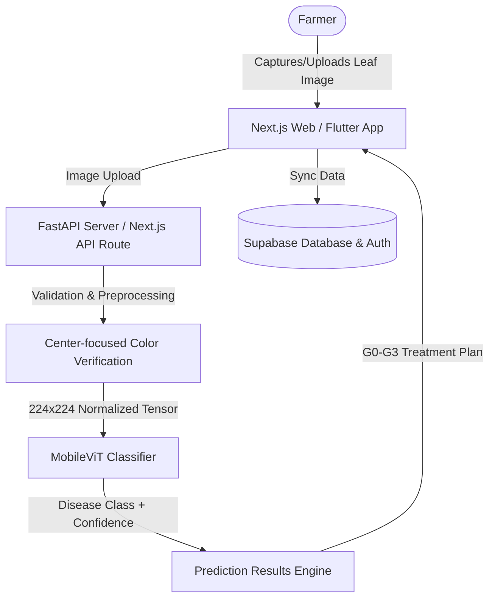

# 🌱 AI Crop Doctor

[](https://nextjs.org/)
[](https://flutter.dev/)
[](https://supabase.com/)
[](https://pytorch.org/)
[](https://bun.sh/)

> **AI-powered mobile crop disease detection, smart crop calendars, and interactive farmer assistance.**

AI Crop Doctor is a modern, farmer-centric ecosystem designed to diagnose crop diseases from leaf images using a **MobileViT-based PyTorch deep learning model**. The platform features a responsive **Next.js** web application with full cloud sync (via **Supabase**), a companion **Flutter** mobile application, and an interactive **AI Crop Coach** assistant.

---

## ✨ Features

- 📸 **AI Leaf Diagnosis:** Scan or upload leaf images to detect crop diseases instantly with high-accuracy predictions.
- 🩺 **Stage-Based Analysis:** Diagnoses are classified into severity stages (**G0** to **G3**) with tailored treatment recommendations.
- 📆 **Smart Crop Calendar & Reminders:** Automatically builds crop schedules based on sowing dates and delivers push alerts/notifications for watering, fertilization, and monitoring.
- 💬 **Crop Coach AI Assistant:** Chat with an AI assistant to ask questions about crop health, organic pest control, and farming tips.
- 🔐 **Secure Cloud Sync:** Create an account to sync history, calendars, and preferences across devices using Supabase Auth.
- 📊 **Detailed Architecture:** Interactive visual system context diagrams explaining the MobileViT training parameters and image validation pipelines.

---

## 🏗️ System Architecture



---

## 🛠️ Tech Stack

### Web App (Next.js)
* **Framework:** Next.js 15 (App Router)
* **Language:** TypeScript
* **State Management:** Reactive Client Store (localStorage + `useSyncExternalStore`)
* **Styling:** Tailwind CSS + Vanilla CSS variables
* **Database & Auth:** Supabase Client SDK

### Mobile App (Flutter)
* **Framework:** Flutter SDK
* **Language:** Dart
* **State Management:** Provider pattern
* **Hardware Integration:** Camera & Image Picker SDKs

### AI & Machine Learning
* **Model Architecture:** MobileViT Small (Transfer Learning via PyTorch & `timm`)
* **Training Platform:** Google Colab (GPU Acceleration)
* **Validation Pipeline:** Center-focused color checking & minimum-confidence gate (10% threshold)
* **API Server:** Python FastAPI

---

## 📁 Repository Structure

```text
AI_Crop_Doctor/                  # Repository Root
├── README.md                    # Professional Project Documentation (This File)
├── AI_Crop_Doctor/              # Web Application Project (Next.js)
│   ├── src/                    # Source files
│   │   ├── app/                # Pages and API routes (diagnose, auth)
│   │   ├── components/         # Premium UI Components
│   │   ├── lib/                # Database configuration, state, and i18n
│   │   └── services/           # Backend services
│   ├── public/                 # Static assets (3D graphics)
│   ├── .env                    # Local environment secrets (DO NOT COMMIT)
│   ├── tsconfig.json           # TypeScript configuration
│   └── package.json            # Web dependencies and scripts
│
└── AI_Crop_Doctor/ai_crop_doctor_flutter/ # Mobile Application Project (Flutter)
    ├── lib/                    # Dart source code
    │   ├── screens/            # UI Screens (Diagnose, Home, History)
    │   ├── services/           # Backend crop API calls
    │   └── data/               # Models and static crops datasets
    └── pubspec.yaml            # Flutter packages configuration
```

---

## 🚀 Setup & Installation

### ⚡ Prerequisites
Make sure you have installed:
* [Bun](https://bun.sh/) (Recommended) or [Node.js](https://nodejs.org/)
* [Flutter SDK](https://flutter.dev/docs/get-started/install)
* [Git](https://git-scm.com/)

---

### 🌐 Web Application (Next.js)

1. **Navigate to the web project directory:**
   ```bash
   cd AI_Crop_Doctor
   ```

2. **Install dependencies:**
   ```bash
   bun install
   ```

3. **Configure Environment Variables:**
   Create a `.env` file in the `AI_Crop_Doctor/` directory:
   ```env
   NEXT_PUBLIC_SUPABASE_URL=https://your-project-ref.supabase.co
   NEXT_PUBLIC_SUPABASE_PUBLISHABLE_KEY=your-supabase-anon-key
   NEXT_PUBLIC_OPENAI_API_KEY=your-openai-api-key
   NEXT_PUBLIC_API_BASE_URL=/api
   ```
   > ⚠️ **Security Warning:** Never commit `.env` or Google Client Secret files (`client_secret_*.json`) to GitHub. They are ignored by `.gitignore` to protect your credentials.

4. **Run the development server:**
   ```bash
   bun run dev
   ```
   Open [http://localhost:3000](http://localhost:3000) to view it in your browser.

---

### 📱 Mobile Application (Flutter)

1. **Navigate to the Flutter project directory:**
   ```bash
   cd AI_Crop_Doctor/ai_crop_doctor_flutter
   ```

2. **Get packages:**
   ```bash
   flutter pub get
   ```

3. **Run the app on a connected emulator or device:**
   ```bash
   flutter run
   ```

---

## 🧠 Model Training & Training Configuration

The disease classification model utilizes **MobileViT Small** for high-efficiency classification on mobile devices.

| Hyperparameter | Value |
| :--- | :--- |
| **Input Image Size** | 224 × 224 pixels |
| **Batch Size** | 32 |
| **Epochs** | 20 |
| **Optimizer** | AdamW |
| **Base Learning Rate** | 0.0001 |
| **Loss Function** | Cross Entropy Loss |
| **Scheduler** | Cosine Annealing LR |

---

## ⚠️ Disclaimer

AI Crop Doctor is an educational prototype meant to assist with preliminary crop disease identification. Predictions should not replace professional agricultural consulting or laboratory diagnoses. Consult qualified agronomists for commercial decisions.

---

## ⭐ Project Vision

> **"Bridging the gap between state-of-the-art computer vision and accessible, farmer-friendly agricultural care."**
